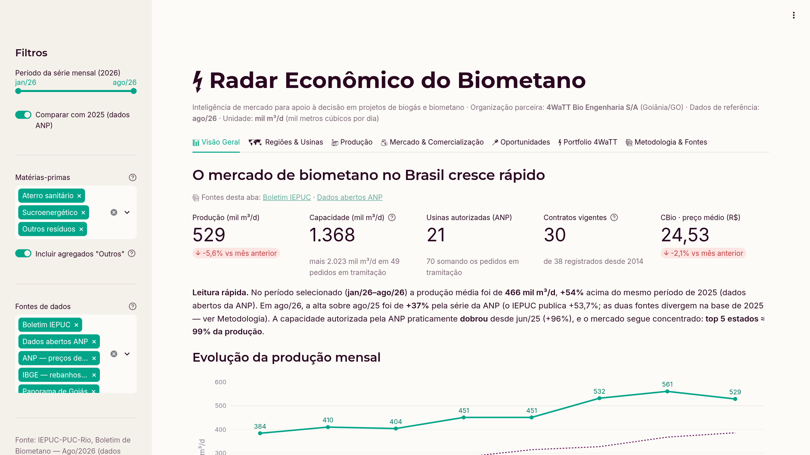
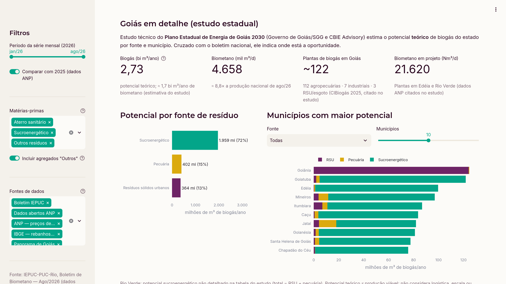

# Relatório Técnico — Projeto Integrador V-A

**Curso:** Big Data e Inteligência Artificial — PUC-Goiás (CEAD / Escola Politécnica e de Artes)
**Estudante:** Nathan Crystiano França
**Organização parceira:** 4WaTT Bio Engenharia S/A — Goiânia/GO
**Data de referência dos dados:** agosto/2026 · **Elaboração:** outubro/2026

---

## 1. Identificação e breve contextualização da organização parceira

A **4WaTT Bio Engenharia S/A** (Goiânia/GO) atua em bioengenharia de resíduos
orgânicos, convertendo resíduos em energia (biogás e biometano). A empresa opera um
modelo de ciclo completo — *projeta, constrói e opera* — com engenharia própria em cada
etapa:

- **Diagnóstico:** EVTE (estudo de viabilidade técnico-econômica), business plan e projetos
  executivos; calculadora de pré-viabilidade (4WaTT Simulador);
- **Execução (EPC):** construção turn-key de usinas de biodigestão e refinaria de biometano
  (modelos BOT e EPCM);
- **Operação (O&M):** contratos recorrentes de operação e manutenção, com automação, SCADA
  e portal do cliente com indicadores em tempo real;
- **Capital:** assessoria de captação bancária para CAPEX (4WaTT Finance).

Sua matriz de resíduos abrange RSU, dejetos suínos e bovinos, resíduo de aviário,
efluentes de frigoríficos e vinhaça/torta de filtro de usinas sucroenergéticas. Projetos
públicos divulgados pela empresa incluem o O&M da usina do CEASA Goiás (Goiânia/GO), o
projeto executivo de biodigestão do Frigorífico Franca (Franca/SP, 2.800 Nm³/dia de biogás,
em operação), a UTB Franca —
biometano a partir de resíduo de curtume, com obras em estágio avançado e licença ambiental emitida —
e a Organo Buritis (Palmeiras de Goiás/GO).

A atuação no estágio curricular na 4WaTT constituiu o vínculo formal que viabilizou este
projeto extensionista: o contexto real da empresa e suas necessidades operacionais
orientaram diretamente a escolha do problema analisado.

## 2. Descrição da necessidade identificada junto à organização

O setor de biometano brasileiro vive um ciclo de forte expansão — a capacidade autorizada
na ANP praticamente dobrou em um ano (697 → 1.368 Mm³/d entre jun/2025 e ago/2026, segundo
o boletim do IEPUC-PUC-Rio) e novos pedidos em tramitação somam mais 2.023 Mm³/d. Nesse
cenário, a equipe comercial/técnica da 4WaTT precisa, para priorizar esforço de
prospecção e sustentar narrativas de viabilidade (EVTE, apresentações a investidores e a
órgãos financiadores):

1. **Visualizar o mercado como um todo** — tamanho, ritmo de crescimento, estrutura
   geográfica e por matéria-prima — a partir de fontes públicas confiáveis;
2. **Posicionar os projetos da empresa no contexto nacional**, evidenciando onde o
   portfolio (substratos industriais/agrícolas × regiões) se situa frente à concentração
   do mercado;
3. **Comunicar os resultados** de forma clara a decisores internos e externos, com KPIs
   justificados e narrativa de data storytelling.

Em termos dos elementos pedidos na proposta do Projeto Integrador:

| Elemento | No contexto da 4WaTT |
|---|---|
| Organização | 4WaTT Bio Engenharia S/A (Goiânia/GO) |
| Setor/área envolvida | Diretoria e áreas comercial e de engenharia (prospecção, EVTE, relação com investidores) |
| Necessidade | Leitura estruturada e recorrente do mercado de biometano, hoje dispersa em boletins em PDF e notícias |
| Público usuário | Diretoria, equipe comercial e engenheiros responsáveis por estudos de viabilidade |
| Decisões apoiadas | (a) em quais estados/municípios e substratos concentrar a prospecção; (b) quais argumentos de mercado usar em EVTEs e apresentações a investidores; (c) quais indicadores acompanhar mensalmente |
| Resultados esperados | Priorização de prospecção baseada em dados, material pronto para propostas e investidores, e uma rotina de monitoramento mensal |

A necessidade identificada foi, portanto: **construir um painel analítico open source que
consolide dados públicos de mercado do biometano e posicione os projetos públicos da 4WaTT
nessa leitura**, servindo como insumo recorrente para decisões comerciais e técnicas.

> Nota de transparência: nesta versão o projeto utiliza exclusivamente **dados públicos**
> (boletim IEPUC com dados ANP/MME/B3, dados abertos e preços da ANP, IBGE, estudo do Governo
> de Goiás e site oficial da empresa), conforme permitido pela proposta
> ("a base poderá ser obtida a partir de fontes públicas, desde que os dados possuam relação
> direta com o problema identificado junto à organização"). A evolução natural do painel —
> incluir o pipeline comercial interno em planilhas — está descrita nas recomendações.

## 3. Descrição da interação realizada com a organização

- O tema e o escopo foram alinhados com **Brunno Bachmann**,
  **CTO** da 4WaTT, que validou a necessidade de inteligência de mercado
  suportada por dados públicos para as frentes comercial e de investidores;
- As informações sobre os projetos da empresa (cases CEASA Goiás, Frigorífico Franca, UTB
  Franca e Organo Buritis) foram obtidas dos canais oficiais de comunicação da organização;
- **[DESCREVER AQUI: reuniões/encontros específicos, solicitações de material, apresentações
  internas realizadas — inclusive a apresentação final dos resultados à equipe, com data e
  participantes]**;
- Os registros formais dessa interação (carta da organização, correspondências) compõem a
  pasta `documentos/` desta entrega.

## 4. Objetivos do projeto

**Objetivo geral:** desenvolver uma solução analítica interativa (dashboard open source em
Python) que transforme dados públicos do mercado de biometano brasileiro em informações
estruturadas para apoio à tomada de decisão da 4WaTT.

**Objetivos específicos:**

1. Estruturar bases de dados de mercado (produção, capacidade, comercialização, RenovaBio)
   a partir do boletim IEPUC-PUC-Rio e fontes públicas complementares;
2. Definir e justificar um conjunto de KPIs relevantes para o contexto da organização;
3. Construir visualizações interativas (Streamlit + Plotly) aplicando princípios de
   visualização de dados (seleção de gráfico, cor, hierarquia, legibilidade);
4. Estruturar a leitura dos resultados como narrativa de data storytelling, conduzindo o
   leitor do contexto do mercado aos insights para a organização;
5. Disponibilizar os resultados à organização parceira.

## 5. Descrição da base de dados

| Base (arquivo) | Conteúdo | Origem | Tratamento |
|---|---|---|---|
| `producao_mensal_2026.csv` | Produção mensal de biometano jan–ago/2026: níveis, crescimento vs ano anterior (%) e média acumulada | Boletim IEPUC Ago/26 (dados ANP) | Transcrição da tabela do boletim |
| `producao_por_estado_2026_08.csv` | Produção e nº de usinas por UF (ago/26) | idem | Participação % recalculada a partir da produção absoluta |
| `producao_por_materia_prima_2026_08.csv` | Produção por substrato: aterro / sucroenergético / outros | idem | — |
| `producao_por_usina_2026_08.csv` | Produção e variação mensal por usina (11 linhas, somando o total do mês) | idem | — |
| `capacidade_anp.csv` | Capacidade autorizada × em tramitação (3 recortes temporais) + nº de usinas/pedidos | idem | — |
| `comercializacao.csv` | Contratos registrados na ANP e transações anunciadas (base IEPUC-Rio) | Boletim (seção Comercialização) | Seleção dos indicadores citados textualmente no boletim |
| `renovabio.csv` | Usinas certificadas, CBios emitidos, preço médio do CBio | Boletim (dados MME/B3) | — |
| `utilizacao_capacidade_2026_08.csv` | Taxa de utilização da capacidade autorizada (Brasil, plantas com 1 ano+, por matéria-prima) | Boletim IEPUC Ago/26 (dados ANP) | Transcrição da tabela do boletim |
| `potencial_biogas_goias.csv` / `potencial_biogas_goias_municipios.csv` | Potencial teórico de biogás em Goiás por fonte (sucroenergético, pecuária, RSU) e pelos 15 municípios de maior potencial | Governo de Goiás (SGG) / CBIE Advisory — *Panorama do Biometano em Goiás* (2026), estudo do Plano Estadual de Energia de Goiás 2030 | Transcrição das tabelas do estudo (m³/ano) |
| `producao_nacional_anp_historico.csv` | Produção nacional mensal de biometano jan/2020–ago/2026 (mil m³/d) | ANP — Dados Abertos de Biometano (produção por UF) | Soma das UFs; regras de leitura de unidades e validação cruzada em `dados/brutos/anp_abertos/PROVENIENCIA.md` |
| `producao_por_uf_anp_mensal.csv` | Produção mensal por UF e região, jan/2020–ago/2026 (mil m³/d) — todas as UFs com produção | ANP — Dados Abertos de Biometano | Gerada por `dados/preparar_anp.py`: volume do mês ÷ dias reais; soma de biometano e biometano comprimido |
| `usinas_anp_2026_08.csv` | As 21 usinas autorizadas em ago/26: UF, município, região, capacidade autorizada e uso da capacidade de processamento de biogás | ANP — Dados Abertos de Biometano (capacidade por usina) | Gerada por `dados/preparar_anp.py`; nomes e municípios com grafia corrigida |
| `potencial_pecuaria_uf_ibge.csv` | Rebanhos (aves, suínos, vacas ordenhadas) e potencial de biogás da pecuária nas 27 UFs (2025) | IBGE — Pesquisa da Pecuária Municipal (API SIDRA) | Gerada por `dados/preparar_ibge.py`, com os coeficientes por animal do estudo de Goiás |
| `precos_combustiveis_uf_mensal.csv` | Preço médio de revenda do diesel S10 e do GNV por UF, jan/2020–set/2026, e valor em R$ por m³ de biometano equivalente | ANP — Levantamento de Preços de Combustíveis | Gerada por `dados/preparar_precos_anp.py`; diesel × 0,87 l/m³ (CIBiogás) |
| `cases_4watt.csv` | Projetos públicos da 4WaTT: substrato, produtos, estágio, destaques, coordenadas e URL de origem | Site oficial 4watt.tech (página inicial, *Solução Biogás* e páginas de cases) | Consolidação das informações públicas; coordenadas aproximadas da sede de cada município |

**Tratamentos realizados:** transcrição e estruturação dos valores publicados (o boletim é
publicado em PDF; a extração da camada de texto foi feita com `pdftotext`), unificação de
tipos, cálculo de participações percentuais e construção do GeoJSON processado
(`geojson_brasil_ufs.geojson`) para os mapas. Limpeza estatística não constituiu foco — as
bases já saem da fonte em formato consolidado. Cópias de todas as páginas e documentos
consultados estão em `dados/brutos/`, com URL e data de coleta em `dados/brutos/LEIA-ME_fontes.md`.

**Validação:** todos os valores transcritos foram conferidos programaticamente em
`notebook/validar_dados.py` (83 verificações): total nacional = 529 Mm³/d, somas por
UF/usina/matéria-prima, participações %, crescimentos mensal e anual, consistência interna
das tabelas ANP, cruzamentos usina↔estado e — para evitar que um erro de digitação se repita
dos dois lados da comparação — **busca literal de cada valor no texto extraído dos PDFs**
das fontes (boletim IEPUC e estudo do Governo de Goiás).

**Validação cruzada com os dados abertos da ANP:** a série nacional reconstruída a partir dos
dados abertos da ANP (soma das UFs) coincide com o boletim IEPUC nos 8 meses de 2026, com
diferença de no máximo 0,4 Mm³/d — o boletim é construído sobre essa mesma base. No CSV de produção da ANP,
a coluna "Produção (m³)" traz o volume do **mês** em m³: para chegar a mil m³/d, divide-se pelos dias
reais do mês (29 em fevereiro de ano bissexto) e por 1.000, somando biometano e biometano comprimido.
As regras de leitura e a conferência estão em `dados/brutos/anp_abertos/PROVENIENCIA.md`. A comparação
entre edições do boletim (jul/26, Ed. 1 × ago/26, Ed. 2) mostrou revisões (jun/26: 530 → 532).
**Para 2025, as fontes divergem:** os níveis implícitos no crescimento anual publicado pelo IEPUC
ficam até 11% abaixo da série atual da ANP (ago/25: 344 × 386 Mm³/d). O painel usa a série real
da ANP para a comparação com 2025 e informa o valor publicado pelo IEPUC ao lado.

**Período e cobertura da série da ANP:** os dados abertos começam em **jan/2020**, primeiro ano
publicado pela agência — o *Anuário Estatístico 2025* da ANP (Tabela 4.18) também traz a
produção de biometano por UF só a partir de 2020. A produção comercial é anterior: a usina de
Dois Arcos (São Pedro da Aldeia/RJ) foi inaugurada em agosto de 2014, e a GNR Fortaleza (CE)
opera desde 2018. Em jan/2020 só a GNR Fortaleza constava como autorizada; Gás Verde e Dois Arcos
foram autorizadas em julho de 2020 — exatamente quando passam a aparecer na série. Além disso, a
ANP só registra usinas **autorizadas**: segundo o BNDES (Teixeira, 2024), em 2022 havia 20 plantas
com purificação produzindo cerca de 400 mil m³/d, enquanto a série da ANP registra média de
~183 mil m³/d naquele ano. O painel, portanto, mede o **biometano regulado**, não todo o biometano
produzido no país.

**Nota de escopo e regulação (biogás × biometano):** o painel acompanha o *biometano* —
gás resultante da purificação do *biogás* (remoção de CO₂, H₂S e umidade), com ~95–99% de
metano, energeticamente equivalente ao gás natural e apto a ser injetado em gasodutos,
abastecer veículos (GNC) ou consumidores industriais. A regulação brasileira desse produto
cabe à **ANP** (Agência Nacional do Petróleo, Gás Natural e Biocombustíveis), que autoriza
produção e comercialização — daí as bases oficiais deste painel. O *biogás* bruto
(mistura de ~50–70% de metano obtida da biodigestão) segue regulação distinta (a energia gerada por sua queima, por exemplo, depende de
licenciamento setorial próprio). A distinção
explica a escolha das fontes: o painel é construído sobre os dados do biometano *regulado*
(ANP/IEPUC) — justamente a camada em que os serviços de engenharia (EPC/O&M) da 4WaTT e sua
narrativa de viabilidade para investidores se posicionam. É também por isso que as usinas de biogás da empresa não
constam no dataset ANP de plantas autorizadas: apenas
projetos de biometano (ex.: UTB Franca, em obra) estariam nesse escopo regulatório.

**Unidade:** mantida a notação do boletim, **Mm³/d = mil metros cúbicos por dia** (notação
usual da ANP/MME; o próprio boletim se refere ao "consumidor industrial de 20 Mm³/d", isto é,
20 mil m³/dia). No painel a unidade é exibida como "mil m³/d" para evitar ambiguidade. O
estudo de Goiás usa m³/ano.

## 6. Indicadores-chave de desempenho (KPIs) definidos e justificativa

| KPI | Definição | Por que importa para a 4WaTT |
|---|---|---|
| Produção nacional (Mm³/d) + variação mensal/anual | Nível e tendência do mercado | Dimensão da oportunidade: decidir onde investir esforço comercial exige saber o ritmo do setor |
| Capacidade autorizada × em tramitação (ANP) | Pipeline de oferta futura | Projetos futuros competem por contratos de EPC/O&M; o pipeline indica demanda futura por engenharia e operação — o core business da empresa |
| Produção e capacidade por região e por UF (ANP) | Cobertura de todas as regiões, inclusive as sem usina | Mostra onde ainda não há biometano (Norte, Centro-Oeste) — mercado a abrir |
| Concentração geográfica (top 5 UFs, % do total) | Distribuição regional da produção | Identifica "espaços em branco": estados fora do top 5 (como GO) têm menor saturação para captação de projetos |
| Participação por matéria-prima | Estrutura de substratos do mercado | Indica qual mix de resíduos está sub-representado — os mesmos que a matriz de atuação da 4WaTT atende |
| Produção por usina / líder de mercado | Estrutura competitiva | Contexto para posicionamento: em que ponto da cadeia (EPC, O&M) há espaço para um player regional crescer |
| Contratos vigentes e transações anunciadas | Demanda comercial efetiva | Evidencia que o mercado está contratando/comprando — insumo direto para a narrativa de viabilidade (EVTE/investidores) |
| CBio: emissões, usinas certificadas, preço médio | Valor do componente carbono | Segundo fluxo de receita por m³ vendido; argumento recorrente em business plans e na captação de financiamento |
| Taxa de utilização da capacidade autorizada (%) | Produção efetiva ÷ capacidade autorizada (ANP) | Usinas operando bem abaixo da capacidade (38,7% no conjunto do parque em ago/26) indicam demanda por O&M e otimização — serviço recorrente da 4WaTT |
| Potencial de biogás da pecuária por estado (IBGE) | Rebanhos × coeficientes por animal | Compara Goiás com o resto do país e mostra onde estão os dejetos que a 4WaTT trata |
| Valor de 1 m³ de biometano frente ao diesel e ao GNV, por estado | Preço de revenda (ANP) em R$ por m³ equivalente | Base da narrativa de viabilidade: quanto o cliente economiza ao substituir o combustível atual |
| Potencial teórico de biogás em Goiás (por fonte e município) | Estimativa do estudo estadual (m³/ano) | Localiza a oportunidade no estado-sede: quais substratos e municípios priorizar na prospecção |

Seguindo Sharda, Delen e Turban (2019) e Rocha (2018), cada KPI foi escolhido por estar
ligado a uma decisão concreta da organização (seção 2), e não pela disponibilidade do dado.

## 7. Justificativa das visualizações utilizadas

| Visualização | Tipo de gráfico | Justificativa |
|---|---|---|
| KPIs de topo (cada aba) | Cartões de indicador com variação | Leitura em 5 segundos; seta e cor apenas para variações reais (intensidade de carbono com cor invertida, pois aumento é piora) |
| Evolução da produção mensal (2026 × 2025) | Linha com marcadores e rótulos + linha de referência pontilhada | Tendência temporal é o KPI central; eixo a partir de zero para não exagerar o crescimento; comparação com o ano anterior opcional (filtro) |
| Produção por estado | Mapa coroplético (GeoJSON das UFs), escala sequencial de um só matiz | Leitura territorial da concentração; estados sem dado em bege, distintos de "valor baixo"; filtro alterna produção, capacidade autorizada e nº de usinas |
| Produção por matéria-prima | Rosca (3 categorias) com percentuais publicados | Composição que fecha 100% com poucas fatias — caso em que a rosca é adequada |
| Utilização da capacidade | Barras horizontais com rótulo | Compara recortes (Brasil, plantas maduras, cada matéria-prima) numa mesma escala percentual |
| Produção por usina | Barras horizontais ordenadas, rótulo "produção · variação %" | Rótulos longos favorecem barras horizontais; a variação vai no rótulo (texto colorido) para que a barra mantenha cor sólida e legível — a versão anterior, colorida só pela variação, deixava a usina líder quase invisível |
| Modal logístico | Barras horizontais (2 categorias) | Substitui a rosca anterior: duas quantidades são comparadas com mais precisão por comprimento |
| Capacidade autorizada × em tramitação | Barras empilhadas por período | Mostra o total e a composição (o que já existe × o que vem) |
| Potencial de Goiás por fonte e por município | Barras horizontais; barras empilhadas por fonte | Ranking de municípios com composição do potencial; filtro por fonte e quantidade |
| Produção por região (2020–2026) | Área empilhada | Mostra a composição regional ao longo do tempo; filtro de regiões |
| Capacidade × produção por região | Barras agrupadas | Evidencia capacidade ociosa e regiões sem nenhuma usina (valor zero explícito) |
| Usinas autorizadas | Tabela com barra de progresso | Lista as 21 usinas com município e uso da capacidade; filtrável por região |
| Potencial de biogás da pecuária por estado (IBGE) | Mapa coroplético + ranking dos 10 maiores em barras, com Goiás em destaque | O mapa mostra a distribuição no país e o ranking dá a posição exata; filtro por rebanho (total, suínos, aves, vacas ordenhadas) |
| Diesel × GNV por estado (ANP) | Linhas por estado e combustível, em R$ por m³ de biometano equivalente | Coloca os dois combustíveis na mesma base de comparação; séries esparsas (como o GNV de Goiás) aparecem como pontos, sem linhas ligando meses distantes; escolha de até 4 estados |
| Portfolio da 4WaTT | Mapa de pontos numerados + tabela | Marcadores numerados (projetos na mesma cidade agrupados) evitam rótulos sobrepostos; a tabela traz os atributos qualitativos |

**Mecanismos de interação (filtros).** Barra lateral com período da série mensal, comparação
com 2025, matérias-primas, inclusão dos agregados "Outros" e **fontes de dados** (cada aba
indica de quais fontes depende; desmarcar uma fonte oculta os gráficos dela e a retira do
pacote de download; novas fontes entram pelo cadastro `dados/fontes.json`); nas abas, métrica do mapa,
regiões, ano inicial da série histórica, ordenação e quantidade de usinas, rebanho do mapa do
IBGE, estados da comparação de preços, fonte e quantidade de municípios de Goiás e estágio dos
projetos da 4WaTT. Todos os gráficos têm *hover* com os valores e as bases podem ser baixadas
em CSV na aba de Metodologia.

**Princípios aplicados** (conforme disciplina de Técnicas de Visualização de Dados):
um único canal estético por dimensão de dado; paleta restrita e consistente em todo o
painel; redução de ruído (sem gridlines desnecessárias, títulos ausentes onde o contexto
já explica); rótulos diretos (valores e percentuais próximos dos elementos); hierarquia
visual com títulos de seção curtos e blocos de *insight* destacados; números no padrão
brasileiro (1.368; 38,7%) e meses em português; acessibilidade com
cores distinguíveis por daltonismo típico e textos em hover. **Identidade visual:** o painel
usa a paleta e as fontes do site da 4WaTT (verde #03A589, roxo #3A0940/#6E2466, dourado #DBAA0F,
fundo creme; Montserrat e Inter) e versão em **tema escuro** (fundo roxo-escuro, roxos e
verdes clareados para manter o contraste; a escala do mapa se inverte para que mais produção
seja sempre mais visível), com significado fixo para cada cor em todos os gráficos —
verde = setor sucroenergético e série principal, roxo = resíduo urbano (aterro/RSU), dourado =
pecuária e outros resíduos. O mapa usa uma escala verde-claro → verde → roxo, de luminosidade
crescente, e os estados sem dado aparecem em bege, distintos de "valor baixo".

### 7.1 Fundamentação acadêmica (estado da arte)

As escolhas do painel dialogam com a literatura recente de *business intelligence*,
visualização de dados e mercados de energia renovável (artigos indexados, localizados em
out/2026 via bases abertas OpenAlex/Crossref — lista completa em "Referências"):

- **Dashboards como instrumento de decisão:** Hjelle et al. (2024) mostram, em estudo
  experimental, que o design das visualizações altera decisões organizacionais; Matheus,
  Janssen e Maheshwari (2020) consolidam dashboards *data-driven* como mecanismo de
  transparência e *accountability* na tomada de decisão — exatamente a função do painel
  construído aqui.
- **Codificações visuais importam:** Bera (2016) demonstra que a escolha de cores em
  dashboards empresariais afeta as decisões dos usuários — motiva a paleta restrita e o
  uso de cor (verde/roxo) apenas no texto da variação % do gráfico de usinas, mantendo as barras
em cor sólida.
- **BI aplicada a dados energéticos:** Muntean et al. (2021) propõem um framework de
  BI & *analytics* para análise de dados do setor energético, na mesma linha metodológica
  adotada (indicadores justificados → visualizações → leitura acionável).
- **Evidência sobre o mercado de biogás/biometano:** Costa et al. (2024) revisam
  aspectos ambientais e perspectivas do mercado brasileiro; Sulewski et al. (2023)
  documentam a maturação do mercado europeu como referência de trajetória; Mignogna
  et al. (2023) atualizam o estado da técnica — ancoragem setorial dos KPIs selecionados.

## 8. Principais análises realizadas

1. **Tendência:** produção subiu de 384 Mm³/d (jan/26) para 529 Mm³/d (ago/26) —
   **+37,8% no ano** — com média jan–ago de 466 Mm³/d, **~54% acima do mesmo período de 2025**
   (série dos dados abertos da ANP). Em agosto/26 isolado, a alta foi de +37% sobre ago/25 pela
   ANP; o IEPUC publica +53,7%, calculado sobre níveis de 2025 que divergem da série atual da
   ANP (seção 5). Desde jan/2020 (70 Mm³/d) a produção mensal cresceu cerca de 7,6 vezes. Pico de 561 Mm³/d em jul/26 e correção de -5,6% em ago/26 — crescimento
   forte, mas com oscilações mensais relevantes.
2. **Pipeline de capacidade:** 21 usinas autorizadas (1.368 Mm³/d) + 49 pedidos em
   tramitação (2.023 Mm³/d). Se todos os pedidos entrarem em operação no cronograma previsto,
   o IEPUC estima 3.391 Mm³/d até dez/2028 — ou seja, a capacidade instalada
   pode **mais que dobrar** (2,5×) em pouco mais de dois anos, com demanda equivalente por
   engenharia de projeto, construção e operação.
3. **Concentração geográfica:** SP (33,6%) + RJ (26,3%) ≈ 60% da produção; top 5 UFs ≈ 99%
   (só o agregado "Outros estados" fica fora). Goiás, estado-sede da 4WaTT, **não produz
   biometano**: o boletim não detalha as UFs do agregado "Outros" (5 usinas, 5 Mm³/d), mas os
   dados abertos da ANP mostram que ele corresponde a Santa Catarina (item 7) — espaço de
   captação ainda desocupado.
4. **Concentração de substrato:** aterros sanitários = ~80% da produção; resíduos
   sucroenergéticos ~19%. Substratos industriais e agrícolas diversificados (curtumes,
   frigoríficos, dejetos de confinamento — o core do portfolio 4WaTT) estão no agregado
   "Outros resíduos": 4 usinas e apenas 5 Mm³/d (~1%), com forte oscilação mensal (-91% em
   ago/26, enquanto aterros cresceram 6,3% e o sucroenergético recuou 4,1%). A participação
   é marginal e ainda instável — é um segmento a ser desenvolvido, não um nicho já
   consolidado.
5. **Demanda comercial:** 38 contratos registrados na ANP desde 2014 (30 vigentes em
   jul/26); 55 transações anunciadas mapeadas pelo IEPUC, com o setor industrial concentrando
   ~55% — e GNC como modal dominante (39 de 55). O CBio adiciona receita de carbono:
   preço médio de R$ 24,53/tCO₂eq em ago/26, com 10 usinas certificadas no RenovaBio.
6. **Utilização da capacidade:** o parque de usinas como um todo operou a **38,7%** da capacidade
   autorizada em ago/26 (51,5% entre as plantas com mais de um ano; aterros 47,4%; sucroenergético 27,2%,
   pela sazonalidade da safra). Construir não basta: operar bem é um gargalo — e um mercado
   para O&M.
7. **Cobertura regional (dados abertos da ANP):** só 9 estados têm usina de biometano
   autorizada e só 6 produziram em ago/26; o **Norte não tem nenhuma usina** e o **Centro-Oeste
   tem uma** (Ivinhema/MS, 8 mil m³/d, sem produção no mês). O agregado "Outros estados" do
   boletim é, na prática, Santa Catarina (5,1 mil m³/d). Capacidade não é produção: a maior usina
   autorizada do país (Paulínia/SP, 226 mil m³/d) processou praticamente zero biogás em ago/26, e
   8 das 21 usinas usaram menos de 10% da capacidade de processamento.
8. **Potencial e preço em todo o país (IBGE e ANP):** aplicando aos rebanhos do IBGE (2025) os
   coeficientes do estudo de Goiás — método que reproduz o número do estudo com diferença menor
   que 1% —, **Goiás é o 5º estado em potencial de biogás da pecuária e o 2º em vacas ordenhadas**,
   atrás de PR, SC, MG e RS. Nos preços, **Goiás praticamente não tem GNV** — só 4 registros
   esporádicos de um único posto desde 2020 e nenhum no último mês (como outros 9 estados): lá o biometano substitui o diesel, e cada m³ vale cerca de R$ 6,12 em diesel evitado
   (set/26) — mais do que o GNV mais caro do país no mês (Ceará, R$ 5,55/m³).
9. **Goiás — potencial sem produção:** o estado não aparece entre os produtores de biometano
   do boletim, mas tem ~122 plantas de biogás (CIBiogás, citado no estudo estadual) e potencial
   teórico estimado em **2,7 bilhões de m³/ano de biogás** (≈ 1,7 bi m³/ano de biometano). O
   sucroenergético responde por 72% desse potencial; a pecuária (402 milhões m³/ano no estudo, com
   rebanhos de 2023; 370 milhões com os rebanhos do IBGE de 2025) é dispersa pelo território; e **Goiânia é o município com maior potencial de RSU** (124 milhões m³/ano,
   34% do estado) — justamente onde a 4WaTT já opera o CEASA.
10. **Posicionamento da 4WaTT:** o portfolio público cobre os três estágios do ciclo
   (operação — CEASA/Organo; construção — UTB Franca; projeto industrial em operação —
   Frigorífico Franca), com substratos concentrados exatamente no segmento sub-representado do mercado.

## 9. Narrativa construída (Data Storytelling)

O painel segue a estrutura **contexto → tensão → leitura → ação**:

1. **Contexto** (aba Visão Geral): o Brasil está virando resíduo em energia — KPIs de
   produção, capacidade e contratos mostram um mercado em expansão acelerada;
2. **Tensão** (abas Produção/Mercado): apesar do crescimento, o mercado é *concentrado* —
   5 estados dominam, aterros dominam o mix, e as usinas operam bem abaixo da capacidade;
3. **Leitura** (abas Oportunidades e Portfolio 4WaTT): o estado-sede tem grande
   potencial e quase nenhuma produção; cruzando isso com o portfolio, o espaço de crescimento
   fica evidente — **Goiás e regiões fora do top 5 × substratos agrícolas, pecuários e urbanos**,
   perfil exato da capacidade EPC+O&M da 4WaTT;
4. **Ação** (blocos de *insight* em cada aba): recomendações objetivas de onde focar
   prospecção, como usar o CBio na narrativa de viabilidade e o que monitorar mensalmente
   com o boletim IEPUC.

Cada aba termina com um bloco "🎯 Insight para a 4WaTT", transformando dado em recomendação —
o padrão de comunicação esperado pela organização para decisores internos e investidores.

## 10. Principais resultados obtidos

- Dashboard interativo com 7 abas, filtros (inclusive por fonte de dados) e tema claro/escuro (Streamlit + Plotly + Pandas, 100% open source),
  rodável com um único comando (`streamlit run streamlit_app.py`) e publicável no Streamlit Community Cloud;
- 16 bases estruturadas em CSV com fonte documentada e cópia das fontes brutas; notebook de
  EDA reproduzível; validação automatizada com 83 verificações, incluindo validação cruzada
  com os dados abertos da ANP;
- KPIs que respondem às perguntas de decisão: ritmo do mercado, pipeline de oferta futura,
  concentração geográfica e por substrato, demanda comercial efetiva e valor do carbono;
- Leitura estratégica consolidada: o cruzamento "estado fora do top 5 × substrato
  agrícola/industrial" é a fronteira de crescimento mais aderente ao modelo da 4WaTT.

{width=100%}

{width=100%}

## 11. Contribuições da solução para a organização parceira

- **Insumo recorrente de inteligência de mercado**: o painel pode ser atualizado mensalmente
  a cada novo boletim IEPUC (transcrição de poucos minutos), mantendo leitura viva para o
  time comercial;
- **Material de apoio a EVTE e captação**: KPIs e mapas prontos para business plans e
  apresentações a investidores/financiadores (a 4WaTT mantém área do investidor);
- **Argumento de posicionamento**: evidencia objetivamente a tese da empresa de atuar onde
  o mercado ainda não se concentrou (substratos industriais/agrícolas em regiões emergentes);
- **Prática de cultura analítica** no time, com código aberto e versionável.

## 12. Conclusões e recomendações

O projeto demonstrou que dados públicos bem estruturados, apresentados com KPIs justificados
e narrativa clara, são suficientes para gerar leitura acionável de um mercado em expansão —
sem depender de dados proprietários na fase inicial. Recomenda-se:

1. **Evoluir o painel** para incluir o pipeline comercial interno da 4WaTT (planilhas de
   oportunidades por substrato/estado/estágio), transformando-o em ferramenta ativa de
   priorização de prospecção — começando pelos municípios goianos de maior potencial
   (Goiânia em RSU; Goiatuba, Edéia, Mineiros e Caçu no sucroenergético; Rio Verde e Jataí
   na pecuária);
2. **Automatizar a atualização**: script que baixe os novos boletins IEPUC e extraia as
   tabelas automaticamente, atualizando o painel sem transcrição manual;
3. **Aprofundar a dimensão de preço** (já incluídos diesel e GNV por estado; faltam GLP, gás
   natural industrial e energia elétrica) para completar a leitura econômica de viabilidade;
4. **Institucionalizar** o acompanhamento mensal do boletim IEPUC como rotina do time
   comercial da organização.

---

### Referências

- IEPUC-PUC-RIO. *Boletim Mensal de Acompanhamento da Indústria de Biometano no Brasil* —
  Agosto de 2026, Edição Nº 2. Rio de Janeiro: Instituto de Energia da PUC-Rio, 28/09/2026.
  Disponível em: https://www.iepuc.puc-rio.br/arquivos/boletim-biometano/08_Boletim_Biometano_IEPUC_ago_2026.pdf.
  Acesso em: 1 out. 2026.
- 4WATT BIO ENGENHARIA S/A. *Página inicial — Cases*; *Solução Biogás*; *Case CEASA Goiás*;
  *Case UTB Franca*. Goiânia, 2026. Disponível em: https://www.4watt.tech/,
  https://www.4watt.tech/solucao-biogas.html, https://www.4watt.tech/case-ceasa-goias.html e
  https://www.4watt.tech/case-utb-franca.html. Acesso em: 1 e 2 out. 2026.
- AGÊNCIA NACIONAL DO PETRÓLEO, GÁS NATURAL E BIOCOMBUSTÍVEIS (ANP). *Série histórica do
  levantamento de preços de combustíveis* (mensal, por estado, desde jan/2013). Brasília, 2026.
  Disponível em: https://www.gov.br/anp/pt-br/assuntos/precos-e-defesa-da-concorrencia/precos/precos-revenda-e-de-distribuicao-combustiveis/serie-historica-do-levantamento-de-precos.
  Acesso em: 2 out. 2026.
- INSTITUTO BRASILEIRO DE GEOGRAFIA E ESTATÍSTICA (IBGE). *Pesquisa da Pecuária Municipal 2025*:
  tabelas 3939 (efetivo dos rebanhos) e 94 (vacas ordenhadas). Rio de Janeiro: IBGE, 2026.
  Disponível em: https://sidra.ibge.gov.br/tabela/3939 e https://sidra.ibge.gov.br/tabela/94. Acesso em: 2 out. 2026.
- AGÊNCIA NACIONAL DO PETRÓLEO, GÁS NATURAL E BIOCOMBUSTÍVEIS (ANP). *Biometano — dados
  abertos* (produção por UF e capacidade por usina, jan/2020–ago/2026). Brasília, 2026.
  Disponível em: https://www.gov.br/anp/pt-br/assuntos/producao-e-fornecimento-de-biocombustiveis/biometano/biometano-dados-abertos.zip.
  Acesso em: 2 out. 2026.
- IEPUC-PUC-RIO. *Boletim Mensal de Acompanhamento da Indústria de Biometano no Brasil* —
  Julho de 2026, Edição Nº 1. Rio de Janeiro: Instituto de Energia da PUC-Rio, 2026.
  Disponível em: https://www.iepuc.puc-rio.br/arquivos/boletim-biometano/07_Boletim_Biometano_IEPUC_jul_2026.pdf.
  Acesso em: 2 out. 2026.
- TEIXEIRA, Cássio Adriano Nunes. *A hora do biometano no Brasil*. Rio de Janeiro: BNDES, 2024
  (Textos para Discussão, n. 159). Disponível em:
  https://web.bndes.gov.br/bib/jspui/bitstream/1408/24146/1/PRFol_216049_TD%20n.%20159_A%20hora%20do%20biometano%20no%20Brasi.pdf.
  Acesso em: 2 out. 2026.
- AGÊNCIA NACIONAL DO PETRÓLEO, GÁS NATURAL E BIOCOMBUSTÍVEIS (ANP). *Anuário Estatístico
  Brasileiro do Petróleo, Gás Natural e Biocombustíveis 2025*. Rio de Janeiro: ANP, 2025.
  Disponível em: https://www.gov.br/anp/pt-br/centrais-de-conteudo/publicacoes/anuario-estatistico/anuario-estatistico-brasileiro-do-petroleo-gas-natural-e-biocombustiveis-2025.
  Acesso em: 2 out. 2026.
- AGÊNCIA BRASIL. Usina vai transformar em gás natural lixo produzido por oito municípios do Rio.
  Rio de Janeiro, ago. 2014. Disponível em:
  https://agenciabrasil.ebc.com.br/economia/noticia/2014-08/usina-vai-transformar-em-gas-natural-lixo-produzido-por-oito-municipios.
  Acesso em: 2 out. 2026.
- GOIÁS (Estado). Secretaria-Geral de Governo; CBIE ADVISORY. *Panorama do Biometano em
  Goiás*. Estudo técnico do Plano Estadual de Energia de Goiás 2030 (PEEG 2030). Goiânia,
  2026. Disponível em:
  https://goias.gov.br/governo/wp-content/uploads/sites/11/2026/02/Panorama-do-Biometano-em-Goias.pdf.
  Acesso em: 2 out. 2026.
- CODE FOR AMERICA. *click_that_hood — brazil-states.geojson*. GitHub, 2015. Disponível em:
  https://raw.githubusercontent.com/codeforamerica/click_that_hood/master/public/data/brazil-states.geojson.
  Acesso em: 1 out. 2026.
- KNAFLIC, Cole Nussbaumer. *Storytelling com dados*: um guia sobre visualização de dados para profissionais de negócios. Rio de Janeiro: Alta Books, 2019.
- FEIGENBAUM, Anna; ALAMALHODAEI, Aria. *The data storytelling workbook*. London: Routledge, 2020.
- MALIK, Shadan. *Enterprise dashboards: design and best practices for IT*. Indianapolis: Wiley Publishing, 2005.
- ROCHA, E. *Introdução à inteligência de negócios*. Porto Alegre: Bookman/Sagah, 2018.
- SHARDA, R.; DELEN, D.; TURBAN, E. *Business intelligence e análise de dados para gestão do negócio*. 4. ed. Porto Alegre: Bookman, 2019.

**Artigos acadêmicos (busca em out/2026 — OpenAlex/Crossref):**

- BERA, Palash. How colors in business dashboards affect users' decision making. *Communications of the ACM*, v. 59, n. 4, p. 50-57, 2016. DOI: 10.1145/2818993.
- COSTA, Josiel Martins et al. Environmental aspects and perspectives of the Brazilian market for biogas and biomethane from anaerobic digestion: a review. *BioEnergy Research*, v. 17, n. 1, p. 59-72, 2024. DOI: 10.1007/s12155-023-10657-9.
- HJELLE, Sara; MIKALEF, Patrick; ALTWAIJRY, Najwa; PARIDA, Vinit. Organizational decision making and analytics: an experimental study on dashboard visualizations. *Information & Management*, v. 61, n. 6, 104011, 2024. DOI: 10.1016/j.im.2024.104011.
- MATHEUS, Ricardo; JANSSEN, Marijn; MAHESHWARI, Devender. Data science empowering the public: data-driven dashboards for transparent and accountable decision-making in smart cities. *Government Information Quarterly*, v. 37, n. 3, 101284, 2020. DOI: 10.1016/j.giq.2018.01.006.
- MIGNOGNA, Debora et al. Production of biogas and biomethane as renewable energy sources: a review. *Applied Sciences*, v. 13, n. 18, 10219, 2023. DOI: 10.3390/app131810219.
- MUNTEAN, Mihaela I.; DĂNĂIAȚĂ, Doina; HURBEAN, Luminița; JUDE, Cornelia-Rodica. A business intelligence & analytics framework for clean and affordable energy data analysis. *Sustainability*, v. 13, n. 2, 638, 2021. DOI: 10.3390/su13020638.
- SULEWSKI, Piotr; IGNACIUK, Wiktor; SZYMAŃSKA, Magdalena; WĄS, Adam. Development of the biomethane market in Europe. *Energies*, v. 16, n. 4, 2001, 2023. DOI: 10.3390/en16042001.
